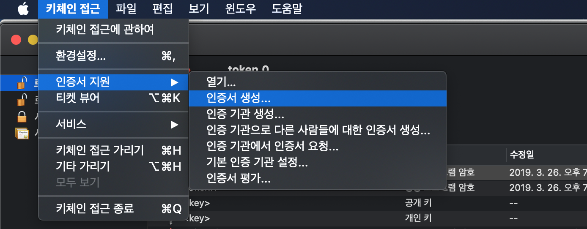

Xcode에서 Vim 설치하여 사용하기 (feat. XVim)


## 1. 프로젝트 다운받기


```
git clone https://github.com/XVimProject/XVim2.git
```

## 2. Xcode 설치 경로 확인

```
xcode-select -p
```

/Applications/Xcode.app/Contents/Developer

다음과 같은 경로가 나오는 것을 확인할 수 있다.

다른 결과가 나온다면 아래 명령어를 통해 경로를 설정해준다.

```
sudo xcode-select -s /Applications/Xcode.app
```


## 3. XVim 플러그인 설치

```
cd XVim2
make
```
make로 실행 시  플러그인 참조로  /Library ... Xcode Plugin 폴더를 참조하게 된다.


## 4. Xcode 코드 사이닝 

Xcode에서 플러그인을 곧바로 지원해주지 않는 관계로 XVim 플러그인을 적용시키기 위해 인증서를 다시 새로 만들어 사이닝 하는 과정을 진행한다. (Xcode 8 이상일 경우에 해당)

먼저  키체인 접근을 실행하여 새로운 인증서를 생성한다.




```
sudo codesign -f -s XcodeSigner /Applications/Xcode.app
```
다음 명령어를 실행하여 Xcode 경로에 새 인증서를 사이닝해준다.


## 5. Xcode 재실행

재실행 시 Unexpected code Bundle "XVim2.xcplugin"이라는 창이 뜨면 Load Bundle을 선택해준다.


